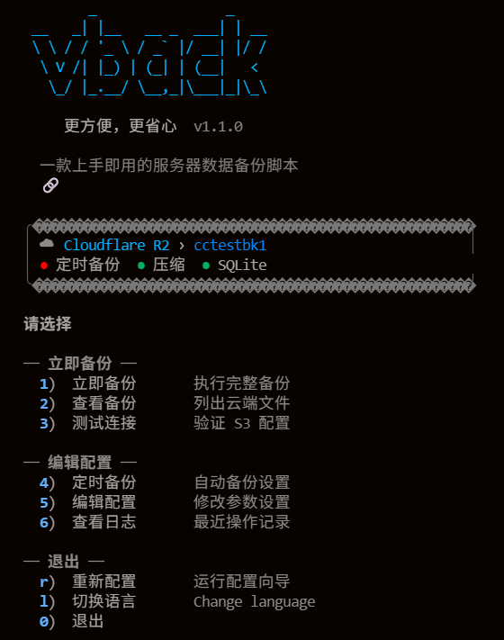
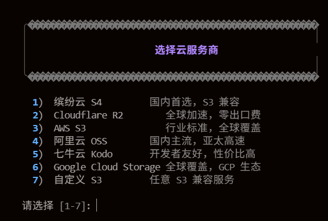
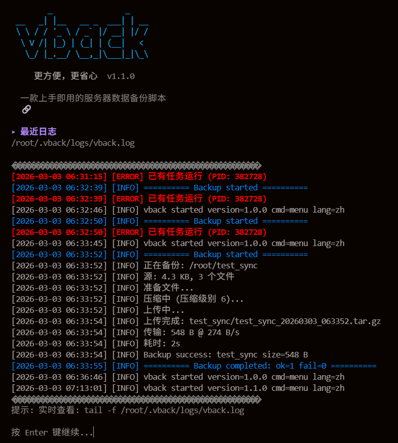

<div align="center">

```
        _                _    
 __   _| |__   __ _  ___| | __
 \ \ / / '_ \ / _` |/ __| |/ /
  \ V /| |_) | (_| | (__|   < 
   \_/ |_.__/ \__,_|\___|_|\_\
```

### 更方便，更省心

**一款上手即用的服务器数据备份脚本**

[](https://opensource.org/licenses/MIT)
[](https://www.gnu.org/software/bash/)
[](http://makeapullrequest.com)
[](https://github.com/caigg188/vback)

[English](#english) | [简体中文](#简体中文)

🔗 **GitHub**: [https://github.com/caigg188/vback](https://github.com/caigg188/vback)

</div>

---

## 简体中文

### 🤔 这玩意儿是干嘛的？

说实话，我写这个脚本纯粹是因为**懒**。

之前每次搞服务器备份，要么手动打包上传（累薯），要么配一堆乱七八糟的工具（烦薯），要么写个脚本结果换台机器又得重新配（气薯）。

所以我就想：**能不能搞一个脚本，下载下来就能用，点几下就配好，然后就不用管了？**

于是就有了 vback。

### ✨ 它能干什么？

- **🚀 开箱即用** - 一个脚本搞定一切，不用装一堆依赖
- **☁️ 多云支持** - 缤纷云、阿里云、七牛云、AWS S3、Cloudflare R2... 随便挑
- **🔒 SQLite 安全备份** - 数据库备份不会损坏（这个坑我踩过）
- **📦 智能压缩** - 自动压缩，省空间省流量
- **⏰ 定时备份** - 设一次，自动跑，安心睡觉
- **🌍 中英双语** - 国内国外都能用
- **📱 交互友好** - 有漂亮的菜单界面，不用背命令

### 📸 截图

<details>
<summary>点击展开看截图</summary>

<br>

**主界面**



<br><br>

**配置向导**



<br><br>

**备份过程**



</details>


**主界面**

```
          _                _    
   __   _| |__   __ _  ___| | __
   \ \ / / '_ \ / _` |/ __| |/ /
    \ V /| |_) | (_| | (__|   < 
     \_/ |_.__/ \__,_|\___|_|\_\

       更方便，更省心  v1.1.0

    一款上手即用的服务器数据备份脚本
    🔗 https://github.com/caigg188/vback

  ╭──────────────────────────────────────────────────╮
  │ ☁  缤纷云 S4 › my-bucket                         │
  │ ● 定时备份  ● 压缩  ● SQLite                      │
  ╰──────────────────────────────────────────────────╯

  请选择

  ── 立即备份 ──
    1)  立即备份           执行完整备份
    2)  查看备份           列出云端文件
    3)  测试连接           验证 S3 配置

  ── 编辑配置 ──
    4)  定时备份           自动备份设置
    5)  编辑配置           修改参数设置
    6)  查看日志           最近操作记录
```

**备份过程**

```
  ╭──────────────────────────────────────────────────╮
  │                   开始备份                        │
  │              2024-01-15 03:00:00                  │
  │              my-bucket/backups                   │
  ╰──────────────────────────────────────────────────╯

  ▸ 正在备份: /var/www/myproject
  ▸ 源: 256.5 MB, 1,234 个文件
  ▸ SQLite: 3 个数据库
  ▸ 准备文件...
  ▸ 压缩中 (压缩级别 6)...
  ✓ 上传完成: myproject/myproject_20240115_030000.tar.gz
  ▸ 传输: 89.2 MB @ 12.5 MB/s
  ▸ 耗时: 7s
```

</details>

### 🚀 快速开始

**一行命令安装：**

```bash
curl -fsSL https://raw.githubusercontent.com/caigg188/vback/main/vback.sh -o vback.sh && chmod +x vback.sh && ./vback.sh
```

或者手动：

```bash
# 下载
wget https://raw.githubusercontent.com/caigg188/vback/main/vback.sh

# 加执行权限
chmod +x vback.sh

# 运行
./vback.sh
```

第一次运行会自动进入配置向导，跟着提示走就行，**不用看文档**。

### 📖 使用方法

#### 交互模式（推荐新手）

```bash
./vback.sh
```

然后看菜单点就行。

#### 命令行模式（适合老手/脚本调用）

```bash
# 立即备份
./vback.sh backup

# 测试连接
./vback.sh test

# 查看云端备份
./vback.sh status

# 安装定时任务（每天自动备份）
./vback.sh install-cron

# 查看当前配置
./vback.sh config

# 重新配置
./vback.sh setup

# 帮助
./vback.sh help
```

#### 一些有用的参数

```bash
# 详细输出（排查问题用）
./vback.sh -v backup

# 指定配置文件
./vback.sh -c /path/to/config backup

# 指定语言
./vback.sh --lang zh
./vback.sh --lang en
```

### ☁️ 支持的云服务商

| 服务商 | 状态 | 说明 |
|--------|------|------|
| 缤纷云 S4 | ✅ 推荐 | 国内首选，便宜好用 |
| 阿里云 OSS | ✅ | 国内老牌，稳定 |
| 七牛云 Kodo | ✅ | 开发者友好 |
| Cloudflare R2 | ✅ | 零出口费，海外首选 |
| AWS S3 | ✅ | 行业标准 |
| Google Cloud Storage | ✅ | GCP 用户适用 |
| 其他 S3 兼容服务 | ✅ | MinIO 等都行 |

### 🗂️ 配置文件在哪？

所有数据都在 `~/.vback/` 目录：

```
~/.vback/
├── config          # 配置文件
├── language        # 语言设置
└── logs/
    └── vback.log   # 运行日志
```

**配置文件是明文的**，你可以直接编辑：

```bash
vim ~/.vback/config
```

### 💡 一些使用技巧

#### 1. 备份目录输入支持 Tab 补全

配置备份目录时，按 Tab 键可以自动补全路径，不用手打。

#### 2. 排除不需要的文件

默认已经排除了 `node_modules`、`.git`、`*.log` 这些，你也可以在配置里自己加。

#### 3. SQLite 数据库会自动安全备份

如果你的项目用了 SQLite（比如很多 Python 项目），vback 会用 SQLite 的 `.backup` 命令来备份，**不会出现数据库损坏的问题**。

这个坑我踩过——直接 cp 正在写入的 SQLite 文件，恢复的时候就傻眼了。

#### 4. 定时备份建议

```bash
# 每天凌晨 3 点（推荐）
0 3 * * *

# 每 6 小时
0 */6 * * *

# 每周日凌晨
0 0 * * 0
```

### ❓ 常见问题

<details>
<summary><b>Q: 备份失败，提示连接错误？</b></summary>

先跑一下测试：

```bash
./vback.sh test
```

检查：
1. Access Key 和 Secret Key 对不对
2. Bucket 名字对不对
3. Endpoint 对不对（不同服务商不一样）
4. 服务器能不能访问外网

</details>

<details>
<summary><b>Q: 怎么恢复备份？</b></summary>

vback 目前只管备份，不管恢复（保持简单）。

恢复很简单，自己下载下来解压就行：

```bash
# 用 s3cmd 下载
s3cmd get s3://your-bucket/backup/xxx.tar.gz

# 解压
tar -xzf xxx.tar.gz
```

</details>

<details>
<summary><b>Q: 定时任务没有执行？</b></summary>

1. 检查 cron 服务有没有在跑：`systemctl status cron`
2. 看看 cron 日志：`grep CRON /var/log/syslog`
3. 手动跑一次看看有没有报错：`./vback.sh backup`

</details>

<details>
<summary><b>Q: 支持增量备份吗？</b></summary>

目前不支持，每次都是全量备份。

说实话，对于大多数小项目，全量备份 + 压缩已经够用了。增量备份会把事情搞复杂，恢复的时候也麻烦。

如果你的数据量真的很大（几十 GB 以上），可能需要考虑其他方案。

</details>

<details>
<summary><b>Q: 可以同时备份到多个云吗？</b></summary>

目前不行，一个配置只能对应一个云。

但你可以复制多份脚本，用不同的配置文件：

```bash
./vback.sh -c ~/.vback/config-aliyun backup
./vback.sh -c ~/.vback/config-r2 backup
```

</details>

### 🛠️ 系统要求

- **操作系统**: Linux / macOS
- **Bash**: 4.0+
- **必需**: `tar`, `gzip`
- **可选**: `rsync`（更快）, `sqlite3`（SQLite 安全备份）, `s3cmd` 或 `aws-cli`（会自动安装）

### 🤝 贡献

欢迎提 Issue 和 PR！

如果你发现了 bug，或者有什么好想法，直接开 Issue 就行，不用客气。

PR 的话，尽量保持代码风格一致，加点注释说明改了啥。

### 📜 License

MIT - 随便用，不用付钱，不用署名（当然署名我也很开心）。

### ⭐ Star History

如果这个项目帮到了你，给个 Star 呗，让更多人看到。

[](https://star-history.com/#caigg188/vback&Date)

---

## English

### 🤔 What is this?

Honestly, I built this because I'm **lazy**.

Every time I needed to backup my servers, I either had to manually tar and upload (exhausting), set up a bunch of complicated tools (annoying), or write a script that I'd have to reconfigure on every new machine (frustrating).

So I thought: **What if there was a script that just works out of the box?**

That's vback.

### ✨ Features

- **🚀 Ready to use** - One script, no complicated setup
- **☁️ Multi-cloud** - AWS S3, Cloudflare R2, Aliyun OSS, Qiniu, and more
- **🔒 SQLite safe backup** - No more corrupted databases
- **📦 Smart compression** - Saves space and bandwidth
- **⏰ Scheduled backups** - Set it and forget it
- **🌍 Bilingual** - English and Chinese
- **📱 Interactive UI** - Nice menus, no commands to memorize

### 🚀 Quick Start

```bash
curl -fsSL https://raw.githubusercontent.com/caigg188/vback/main/vback.sh -o vback.sh && chmod +x vback.sh && ./vback.sh
```

First run will launch the setup wizard. Just follow the prompts.

### 📖 Usage

```bash
# Interactive mode
./vback.sh

# Backup now
./vback.sh backup

# Test connection
./vback.sh test

# Install cron job
./vback.sh install-cron

# Show config
./vback.sh config

# Help
./vback.sh help
```

### ☁️ Supported Cloud Providers

- ✅ AWS S3
- ✅ Cloudflare R2 (recommended for global)
- ✅ Aliyun OSS
- ✅ Qiniu Kodo
- ✅ Bitiful S4
- ✅ Google Cloud Storage
- ✅ Any S3-compatible service

### 📁 Where's the config?

Everything is in `~/.vback/`:

```
~/.vback/
├── config          # Configuration
├── language        # Language preference
└── logs/
    └── vback.log   # Logs
```

### 🤝 Contributing

Issues and PRs are welcome!

### 📜 License

MIT

---

<div align="center">

**If this helped you, consider giving it a ⭐**

🔗 [https://github.com/caigg188/vback](https://github.com/caigg188/vback)

Made with ☕ and mass laziness

</div>
